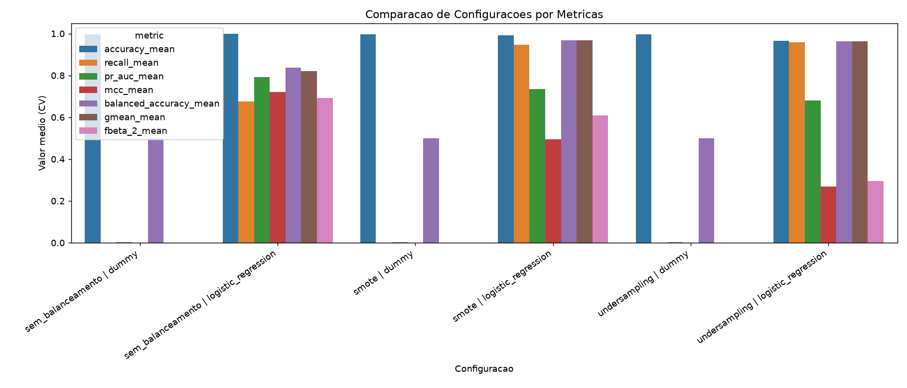
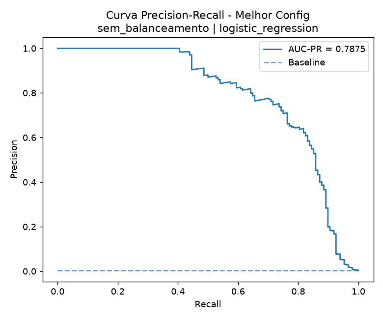
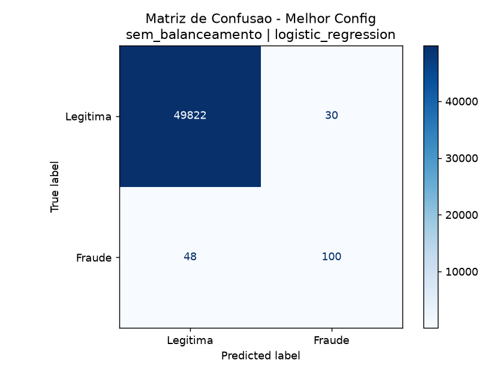

# IV. Resultados e Discussão

## A. Síntese do Cenário Experimental

Os experimentos foram conduzidos com o conjunto integral de dados (284.807 transações), contendo 492 eventos de fraude e prevalência da classe positiva de $p=0{,}001727$ (aproximadamente 0,173%). Nesse regime de desbalanceamento extremo, a acurácia isolada não foi adotada como critério decisório principal, pois tende a superestimar o desempenho de classificadores enviesados para a classe majoritária.

Esse efeito foi observado no baseline Dummy, que obteve acurácia média de 0,9983, porém recall nulo para fraude e AUC-PR próxima à prevalência da classe positiva ($\approx 0{,}001727$). Assim, confirmou-se que o baseline não apresenta capacidade discriminativa útil para a classe rara.

| Tabela I. Comparação de Configurações por Métricas Principais (média ± desvio-padrão em CV) |
|---|

| Configuração | AUC-PR | Precisão | Recall | MCC |
|---|---:|---:|---:|---:|
| Sem balanceamento + SVM-RBF | 0,8188 ± 0,0305 | 0,9542 ± 0,0301 | 0,6667 ± 0,0166 | 0,7972 ± 0,0173 |
| Sem balanceamento + Regressão Logística | 0,7607 ± 0,0224 | 0,8827 ± 0,0368 | 0,6221 ± 0,0457 | 0,7402 ± 0,0341 |
| SMOTE + Regressão Logística | 0,7312 ± 0,0308 | 0,0592 ± 0,0038 | 0,9125 ± 0,0258 | 0,2288 ± 0,0089 |
| Undersampling + Regressão Logística | 0,6993 ± 0,0187 | 0,0480 ± 0,0072 | 0,9146 ± 0,0187 | 0,2051 ± 0,0170 |
| Undersampling + SVM-RBF | 0,6747 ± 0,0289 | 0,1006 ± 0,0164 | 0,8780 ± 0,0203 | 0,2939 ± 0,0280 |
| SMOTE + SVM-RBF | 0,6642 ± 0,0528 | 0,0956 ± 0,0080 | 0,8700 ± 0,0345 | 0,2853 ± 0,0119 |

Fonte: elaboração própria a partir dos resultados do pipeline.

## B. Comparação Entre Modelos e Estratégias de Balanceamento

A comparação entre cenários de balanceamento e modelos indicou superioridade consistente da configuração sem balanceamento com SVM-RBF. Na validação cruzada estratificada de 5 folds, essa configuração apresentou AUC-PR média de 0,8188 (desvio-padrão de 0,0305), precisão de 0,9542 (0,0301), recall de 0,6667 (0,0166), MCC de 0,7972 (0,0173) e Brier score de 0,000496 (0,000126).

A Regressão Logística sem balanceamento permaneceu como segunda melhor alternativa em AUC-PR (0,7607), com decréscimo concomitante em precisão, recall e MCC quando comparada ao SVM-RBF.

Quando técnicas de rebalanceamento explícito (SMOTE e undersampling) foram aplicadas, observou-se elevação de sensibilidade (recall entre 0,870 e 0,915), acompanhada por redução substantiva de precisão (entre 0,048 e 0,101) e de MCC (entre 0,205 e 0,294). Portanto, verificou-se trade-off relevante entre recuperação da classe minoritária e confiabilidade dos alertas.

A Figura 1 sintetiza visualmente esse comportamento multivariado e reforça a leitura da Tabela I ao evidenciar a superioridade da configuração sem balanceamento com SVM-RBF nas métricas mais relevantes para classe rara.

Fonte: elaboração própria.

## C. Interpretação Operacional e Robustez das Métricas

Sob perspectiva operacional, a diferença de precisão foi crítica. Pela relação

$$
\frac{FP}{TP}=\frac{1-\text{Precision}}{\text{Precision}},
$$

estimou-se que a configuração sem balanceamento com SVM-RBF produz aproximadamente 0,05 falso positivo por verdadeiro positivo. Em contraste, SMOTE + Regressão Logística produz aproximadamente 15,9, e undersampling + Regressão Logística, aproximadamente 19,9. Esses valores indicam aumento expressivo da carga de investigação quando se prioriza apenas recall.

| Tabela II. Indicadores Operacionais de Alertas (FP/TP) |
|---|

| Configuração | Precisão | $FP/TP = (1-P)/P$ |
|---|---:|---:|
| Sem balanceamento + SVM-RBF | 0,9542 | 0,05 |
| SMOTE + Regressão Logística | 0,0592 | 15,89 |
| Undersampling + Regressão Logística | 0,0480 | 19,85 |

Fonte: elaboração própria a partir das métricas médias em validação cruzada.

A análise por AUC-PR reforçou esse diagnóstico. Considerando que a linha de base em Precision-Recall para problemas raros é aproximadamente a prevalência da classe positiva, o ganho relativo da melhor configuração foi da ordem de 474 vezes ($0{,}8188/0{,}001727$). Além disso, embora a AUC-ROC tenha permanecido elevada entre modelos não triviais (0,946 a 0,980), sua capacidade de discriminar configurações foi inferior à da AUC-PR, resultado compatível com a literatura para baixa prevalência.

A Figura 2 apresenta a curva Precision-Recall da melhor configuração, com linha de base associada à prevalência da classe positiva. O afastamento entre a curva do modelo e a linha de base sustenta a capacidade discriminativa obtida em AUC-PR.

Fonte: elaboração própria.

A convergência entre métricas adicionais para desbalanceamento (MCC, G-mean e balanced accuracy) corroborou a escolha final. A melhor configuração maximizou simultaneamente AUC-PR e MCC, com balanced accuracy de 0,8333 e G-mean de 0,8165. Já os cenários com rebalanceamento elevaram balanced accuracy para a faixa de 0,93 a 0,94, porém sem ganho correspondente em AUC-PR e MCC, sugerindo melhora parcial concentrada em sensibilidade.

| Tabela III. Desempenho OOF da Melhor Configuração |
|---|

| Configuração | Acurácia | Precisão | Recall | F1 | MCC | Balanced Accuracy | G-mean | Brier | AUC-ROC | AUC-PR |
|---|---:|---:|---:|---:|---:|---:|---:|---:|---:|---:|
| Sem balanceamento + SVM-RBF | 0,9994 | 0,9535 | 0,6667 | 0,7847 | 0,7970 | 0,8333 | 0,8165 | 0,0005 | 0,9455 | 0,8156 |

Fonte: elaboração própria a partir da agregação out-of-fold.

## D. Discussão Integrada, Evidências e Limitações

No conjunto, os resultados indicaram que, para este problema e para o protocolo experimental adotado, o melhor compromisso entre capacidade discriminativa, robustez estatística e custo operacional foi obtido pelo SVM-RBF sem rebalanceamento explícito. Tal evidência é coerente com a hipótese de que a fronteira não linear do SVM foi suficiente para capturar padrões relevantes de fraude no espaço anonimizado de atributos, sem necessidade de alterar a distribuição original de classes.

A Figura 3 complementa a interpretação ao explicitar a matriz de confusão da melhor configuração, evidenciando a preservação de especificidade elevada com recuperação parcial, porém consistente, da classe de fraude.

Fonte: elaboração própria.

A discussão apresentada é suportada por evidências quantitativas e visuais consistentes entre si (Tabelas I-III e Figuras 1-3), mantendo alinhamento com o critério metodológico de priorizar métricas robustas para desbalanceamento extremo.

Como limitação metodológica, não foi conduzido teste formal de hipótese entre modelos (por exemplo, testes pareados por fold para AUC-PR). Assim, as diferenças observadas devem ser interpretadas como evidência empírica consistente, porém não inferência estatística definitiva. Como continuidade, recomenda-se análise de limiar orientada a custo, explicitação de custos de falsos positivos/falsos negativos e avaliação temporal para investigar efeitos de drift de conceito.
